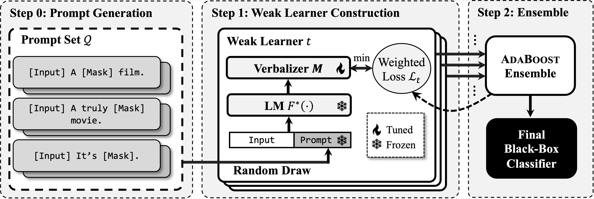

# PromptBoosting
This is the official implementation of the paper *PromptBoosting: Black-Box Text Classification with Ten Forward Passes*.

## Overview

In this work we propose PromptBoosting, a query-efficient procedure for building a text classifier from a neural language model (LM) without access to the LM’s parameters, gradients, or hidden representations. The pipeline includes:

0. Prompt pool construction (using the method from [LM-BFF](https://arxiv.org/pdf/2012.15723.pdf))
1. Weak learner construction through verbalizer learning
2. Model ensemble using AdaBoost algorithm


## Requirements
The dependency packages can be found in `requirements.txt` file. One can use `pip install -r requirements.txt` to configure the environment. We use python 3.8 to run the experiments.

## Prepare the Data
Similar to our baselines (DART, BBT, RLPrompt), we use the same few-shot split data from [LM-BFF](https://arxiv.org/pdf/2012.15723.pdf). One can directly download the data from the official github repository of LM-BFF([here](https://github.com/princeton-nlp/LM-BFF)).
Or you can directly download it from [here](https://drive.google.com/file/d/1GKzx-NqWovGB8V2KO3Qmw0yufqTgf0X1/view?usp=sharing) and unzip it. The directory should looks like:
```
prompt_boosting/
    datasets/
        original/
            agnews/
            MNLI/
            mr/
            ...
    scripts/
    src/
    templates/
```

#### 1. Generating few-shot splits
To generate the few-shot data, use the following command:
```{sh}
python scripts/generate_k_shot_data.py --data_dir datasets/original --output_dir datasets --task {dataset_name}
```
Current supported datasets for `--task`: SST-2/mr/trec/MNLI.SNLI/QNLI/RTE/agnews

To generate the training data larger than 16-shot per class, use the following command:
```{sh}
python scripts/generate_low_resource_data.py --data_dir datasets/original --output_dir datasets --task {dataset_name}
```

Since the AG's News dataset is not in the repository of LM-BFF, you need to download it by running the following command before generating few-shot splits:
```sh
python scripts/download_ag.py
```
Then you can use `generate_k_shot_data.py` and  `generate_low_resource_data.py` to generate the few-shot splits.

#### 2. Preprocess full training data (not required)
If you want to evaluate PromptBoosting on the full training data (in the paper we evaluate it on SST, MR, TREC, and RTE datasets), we need to resplit the dataset (because the labeled test set is unavailable and we use the validation set for testing). 
```sh
python scripts/resplit_dataset.py
```
For SST-2 released [here](https://nlp.stanford.edu/sentiment/), the labeled test set is available. Therefore, we use the original test set for testing. Use the scripts below to preprocessing
```sh
python scripts/transform_sst_test.py
```


## Running the experiments
The implementation of PromptBoosting is in the folder `./src`. 

### 1. Preprocessing (optional)
Pre-compute the test set prediction using the command:
```sh
python scripts/pre_compute_testset.py --dataset sst --model roberta --use_part_template --start_idx 0 --end_idx 10 --sort_dataset --fewshot --fewshot_k 16 --fewshot_seed 13 
```
`dataset`: choices include `sst, mr, agnews, trec, snli, mnli, qnli, rte`.

### 2. Main experiments
To run the codes, use the following command:
```{sh}
python ensemble_training.py --adaboost_weak_cls 200 --dataset trec --model roberta --label_set_size 3 --change_template --use_part_templates --start_idx 0 --end_idx 10 --sort_dataset --fewshot --fewshot_k 16 --fewshot_seed 13
```
Explanations on the parameters:

`adaboost_weak_cls`: the maximum number of weak classifiers during training. In the paper, we use 200 for all experiments.

`dataset`: choices include `sst, mr, agnews, trec, snli, mnli, qnli, rte`.

`label_set_size`: when we screen the verbalizer, we use the top-k tokens for each class to construct the candidates. This parameter is indeed the value of k. For different datasets, we use different `label_set_size (or k)` (depending on each dataset's class number). We set `k=50` for SST-2/MR/QNLI/RTE dataset (binary classification), `k=10` for SNLI/MNLI/AG's News, and `k=5` for TREC.

`change_template`: whether randomly change the prompt for each weak classifier training. If we use the same prompt for all weak classifiers, then the performance will be very weak. See Table 3 in the paper.

`use_part_templates`: whether use only part of templates instead of all templates.

`start_idx, end_idx`: controls the templates we use ([start_idx, end_idx). In the paper we use templates 1-10

`sort_dataset`: sort the dataset according to the length of the input. This is for acceleration in batch (examples with similar length will be grouped into the same batch and decrease the padding operations.) However, for the few-shot setting, this is not necessary.

`fewshot`: whether use few-shot setting or full data training

`fewshot_k`: by default you should set it to 16.

`fewshot_seed`: random seed for generating few-shot splits. choices include [12, 21, 42, 87, 100]

`use_wandb`: you can use WANDB to log the training process by using `--use_wandb`

**Note**: as we have discussed in the experiments (if running experiments using the above commands you can also find the phenomenon), we cannot use Adaboost to ensemble models on SST and MR datasets. Individual weak classifiers can achieve 100% accuracy because the training data is small and easy for the model to fit. Therefore, in 16-shot few-shot setting, we do not ensemble classifiers on SST and MR datasets. Instead, we directly learn weak learners on the unweighted training set and use the weak learner with the best validation performance as the final model (instead of the ensembled model). To run experiments on SST and MR datasets in the 16-shot setting, use the following command:

```{sh}
python weakcls_training.py --dataset sst --model roberta --label_set_size 50  --max_template_num 10 --sort_dataset --fewshot --fewshot_k 16 --fewshot_seed 100
```
`--max_template_num` controls the number of prompts we use (similar to `start_idx, end_idx` above. `max_template_num=10` means we use the top-10 prompts for training.)

**Note**: To run experiments in Figure 2, use the following command:

```
python ensemble_training.py --adaboost_weak_cls 200 --dataset sst --model roberta --label_set_size 50 --change_template --use_part_templates --sort_dataset --low --fewshot_k {32,64,128,256} --fewshot_seed 100
```
The key difference is we change `--fewshot` to `--low` to represent the setting in Figure 2. We still use `--fewshot_k` to indicate the training data size. Note that we will ensemble weak learners for experiments in Figure 2 for SST/MR datasets. 


### Refinement of Prompts
To reproduce the prompt refinement experiments in Figure 2 in the paper, we need to first evaluate the prompts based on the unweighted training set. Use the following command:
```sh
python scripts/template_refinement.py --dataset snli --sort_dataset --model roberta --label_set_size 10 --{fewshot/low} --fewshot_k {16,32,64,128,256} --fewshot_seed {13,21,42,87,100}
```
Similarly, if you want to run the experiments in Figure 2 (`k=32 or more`), please use `--low` instead of  `--fewshot`.

After that, use the following command to evaluate the performance:

```sh
python ensemble_training.py --adaboost_weak_cls 200 --dataset snli --model roberta --label_set_size 10 --filter_templates --change_template --use_part_templates --sort_dataset --{fewshot/low} --fewshot_k {16,32,64,128,256} --fewshot_seed {13,21,42,87,100}
```

### Generating Prompts with LM-BFF
We employ the method of LM-BFF to generate prompts with the T5 model. One can refer to the repository of LM-BFF for detailed explanations. To run the generation code, use the following command:
```{sh}
python scripts/generate_templates.py --t5_model t5-large --seed {13,21,42,87,100} --task_name {SST-2,mr, ag_news, trec, MNLI, SNLI, QNLI, RTE} --output_dir templates --data_dir datasets/k-shot/ --beam 100 --k 16
```
This scripts will generate prompts based on the few-shot training data (`--seed` indicates which few-shot split you will use). By default it will generate 5 groups of prompts for the 5 different splits. For save of time, we only generate prompts based on 1 split and use that group of prompts for all the other splits of dataset for model training.

For GPUs without large enough memory (*i.e.*, V100 with 16GB memory, one may change the t5 model to `t5-large`). We use this model to generate prompts for AG's News dataset. Since the LM-BFF repository provides generated prompts for the other datasets, we directly use their generations and did not rerun the code for the generation.


Some of our implementation comes from LM-BFF:
```bibtex
@inproceedings{gao2021making,
   title={Making Pre-trained Language Models Better Few-shot Learners},
   author={Gao, Tianyu and Fisch, Adam and Chen, Danqi},
   booktitle={Association for Computational Linguistics (ACL)},
   year={2021}
}
```

### Citation
```tex
@article{hou2022promptboosting,
  title={PromptBoosting: Black-Box Text Classification with Ten Forward Passes},
  author={Hou, Bairu and O'Connor, Joe and Andreas, Jacob and Chang, Shiyu and Zhang, Yang},
  journal={arXiv preprint arXiv:2212.09257},
  year={2022}
}
```
